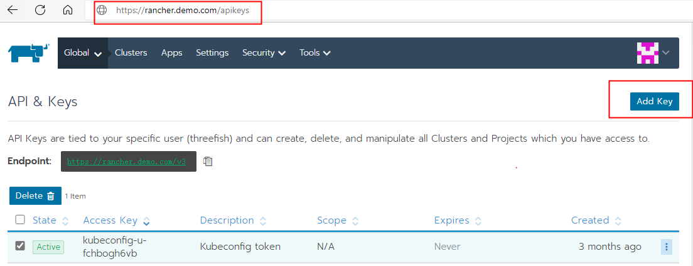
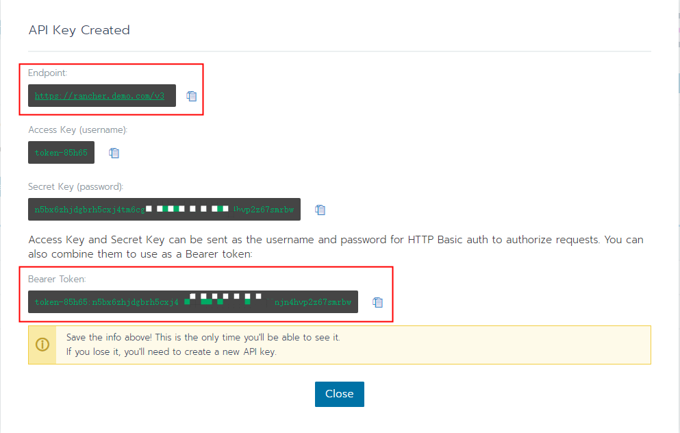
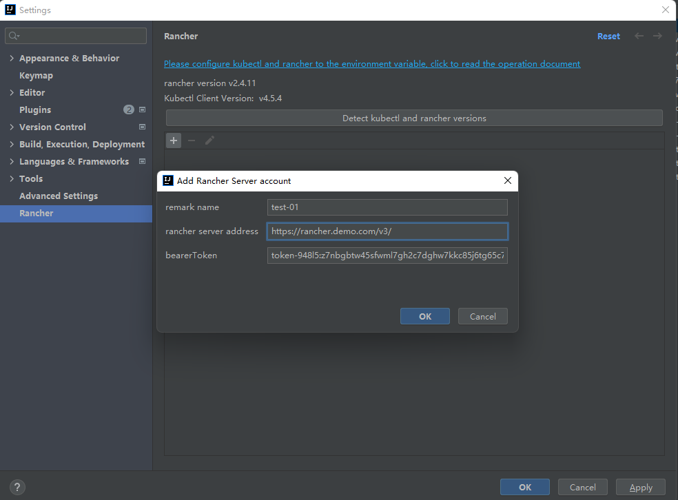
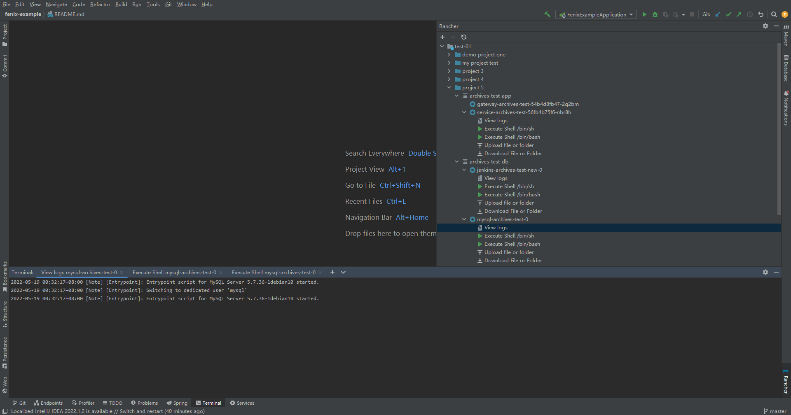
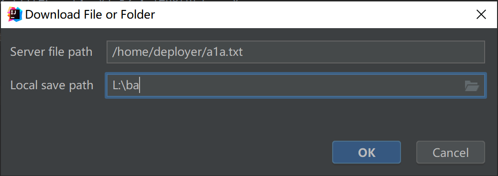
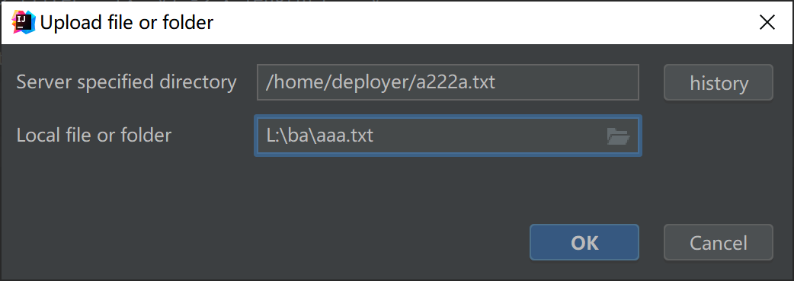
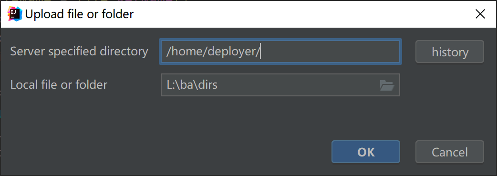

English | [简体中文](./README.zh-cn.md)

## rancher plugin

https://plugins.jetbrains.com/plugin/19316-rancher

### Basic environment configuration

#### The first step is to download the rancher-cli file

> [rancher-cli distribution download address](https://github.com/rancher/cli/releases)

#### The second step is to download the kubectl file

> [installation tool | Kubernetes](https://kubernetes.io/docs/tasks/tools/)

#### The third step configures environment variables

> Configure rancher and kubectl to the environment variable Path

##### For example, under the window

- rancher file path: C:\userbin\rancher.exe
- kubectl file path: C:\userbin\kubectl.exe
- The environment variables are set as follows

> Path=C:\userbin\

##### For example, under the linux

- 下载 https://dl.k8s.io/release/v1.27.3/bin/darwin/arm64/kubectl 将其保存到 $PATH 目录下（终端中执行可查看对应目录：echo $PATH）

- 在https://github.com/rancher/cli/releases 下载页面中下载对应的rancher可执行文件，同样将其保存到 $PATH 目录下

#### Operation screenshot

#### Click the Detect button in the configuration before adding the account information

#### File upload and download

