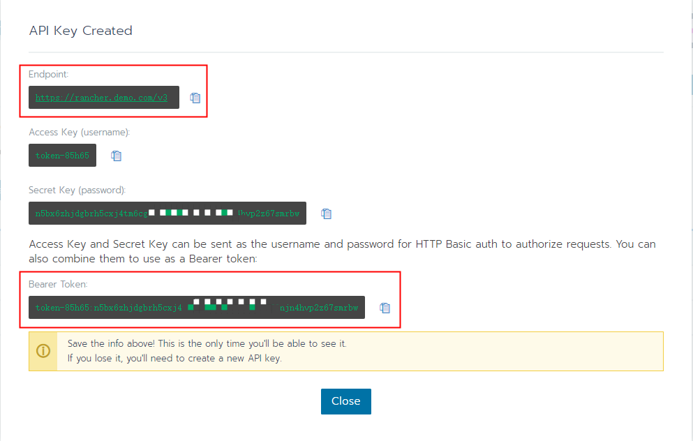

[English](./README.md) | 简体中文

## rancher plugin


https://plugins.jetbrains.com/plugin/19316-rancher


### 基础环境配置


#### 第一步下载 rancher-cli 文件

> [rancher-cli 发行版本下载地址](https://github.com/rancher/cli/releases)
> 下载页面中下载对应的rancher可执行文件，将其保存到 $PATH 目录下（终端中执行可查看对应目录：echo $PATH）

#### 第二步下载 kubectl 文件

> [安装工具 | Kubernetes](https://kubernetes.io/docs/tasks/tools/)
>
> 

#### 第三步配置环境变量

> 将 rancher 和 kubectl 配置到环境变量Path中

##### 例如window下

- rancher文件路径: C:\userbin\rancher.exe
- kubectl文件路径: C:\userbin\kubectl.exe
- 环境变量设置如下

> Path=C:\userbin\

##### 例如Linux环境下

- 下载 https://dl.k8s.io/release/v1.27.3/bin/darwin/arm64/kubectl 将其保存到 $PATH 目录下（终端中执行可查看对应目录：echo $PATH）

- 在https://github.com/rancher/cli/releases 下载页面中下载对应的rancher可执行文件，同样将其保存到 $PATH 目录下


##### 例如macos环境下

```
mkdir -p /usr/local/bin
cd /usr/local/bin
# 将 /usr/local/bin 添加到 path 环境变量中 ，参考 https://stackoverflow.com/questions/11025980/how-to-add-usr-local-bin-in-path-on-mac
# 删除旧文件，请自己备份.Delete old files and back them up yourself
rm -rf  rancher
rm -rf  kubectl


curl -LO https://github.com/rancher/cli/releases/download/v2.6.11/rancher-darwin-amd64-v2.6.11.tar.gz
tar zxvf rancher-darwin-amd64-v2.6.11.tar.gz
cp rancher-v2.6.11/rancher ./
rm -rf rancher-darwin-amd64-v2.6.11.tar.gz

##  for MACOS intel CPU
curl -LO "https://dl.k8s.io/release/$(curl -L -s https://dl.k8s.io/release/stable.txt)/bin/darwin/amd64/kubectl"
## for Apple Silicon CPU
curl -LO "https://dl.k8s.io/release/$(curl -L -s https://dl.k8s.io/release/stable.txt)/bin/darwin/arm64/kubectl"

## 重启一下
reboot
```


#### 操作截图




#### 在配置中先点击检测按钮，再添加账户信息


#### 文件上传下载


