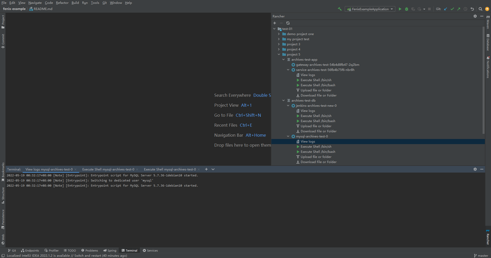

[English](./README.md) | 简体中文

## rancher plugin

https://plugins.jetbrains.com/plugin/19316-rancher

### 基础环境配置

#### 第一步下载 rancher-cli 文件

> [rancher-cli 发行版本下载地址](https://github.com/rancher/cli/releases)

#### 第二步下载 kubectl 文件

> [安装工具 | Kubernetes](https://kubernetes.io/docs/tasks/tools/)

#### 第三步配置环境变量

> 将 rancher 和 kubectl 配置到环境变量Path中

##### 例如window下

- rancher文件路径: C:\userbin\rancher.exe
- kubectl文件路径: C:\userbin\kubectl.exe
- 环境变量设置如下

> Path=C:\userbin\

操作截图

Operation screenshot

